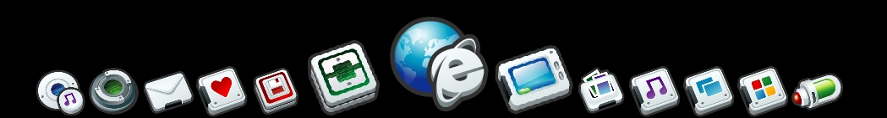



## A DirectX Program Dock

### Description

I was inspired by MobyDock (http://www.mobydock.tk/) and created this program which can be used to replace the taskbar. It’s based on DirectX 8 for VB and needs just a little few tweaks (transparent background and anti-aliasing for example) but because the lack of time I can’t finish my code. So feel free to download the code and finish it on your own with your customs features.

You need to create a folder called (“icons”) in App.Path and put some PNG-Files in it. For the screenshot I used a PNG set from http://www.rokey.net/ but you can add any 128x128 PNG files you want.
 
### More Info
 

             |
---                |---
**Submitted On**   |2004-08-01 07:41:04
**By**             |[Peacemaker2000](https://github.com/Planet-Source-Code/PSCIndex/blob/master/ByAuthor/peacemaker2000.md)
**Level**          |Intermediate
**User Rating**    |5.0 (45 globes from 9 users)
**Compatibility**  |VB 6\.0
**Category**       |[DirectX](https://github.com/Planet-Source-Code/PSCIndex/blob/master/ByCategory/directx__1-44.md)
**World**          |[Visual Basic](https://github.com/Planet-Source-Code/PSCIndex/blob/master/ByWorld/visual-basic.md)
**Archive File**   |[A\_DirectX\_177638812004\.zip](https://github.com/Planet-Source-Code/peacemaker2000-a-directx-program-dock__1-55282/archive/master.zip)

